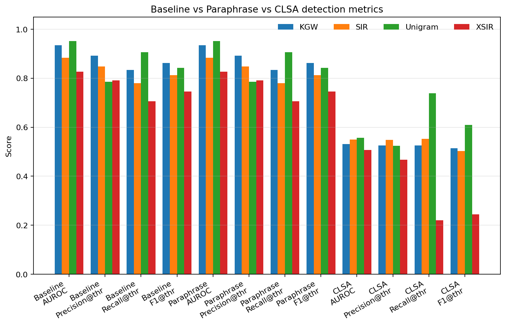
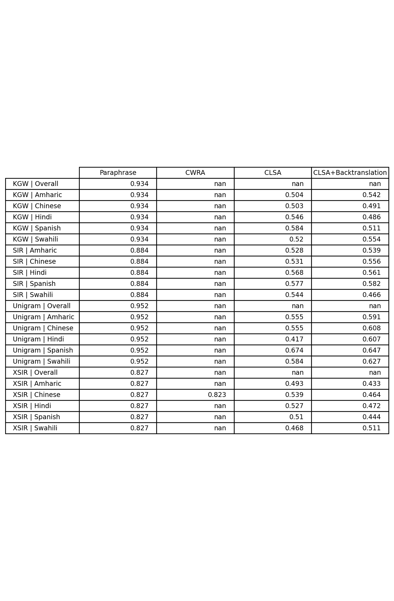
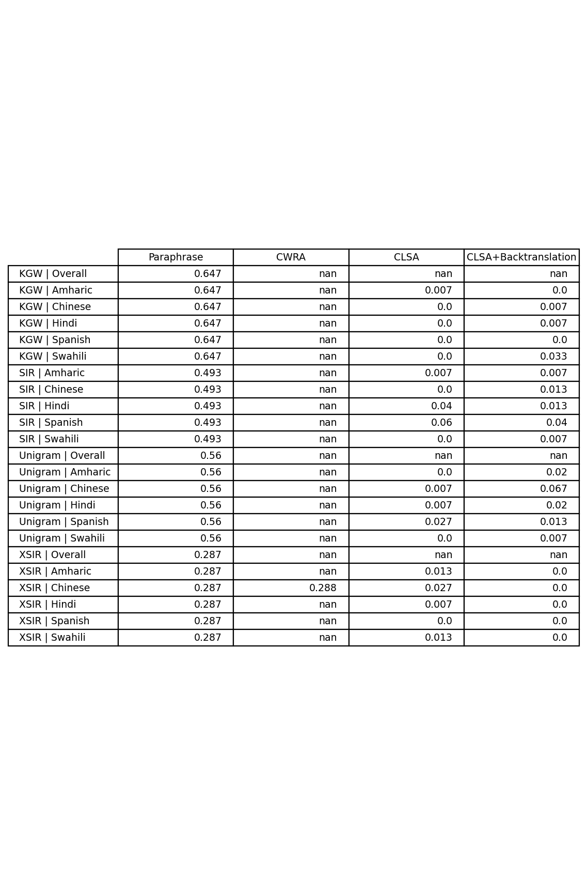
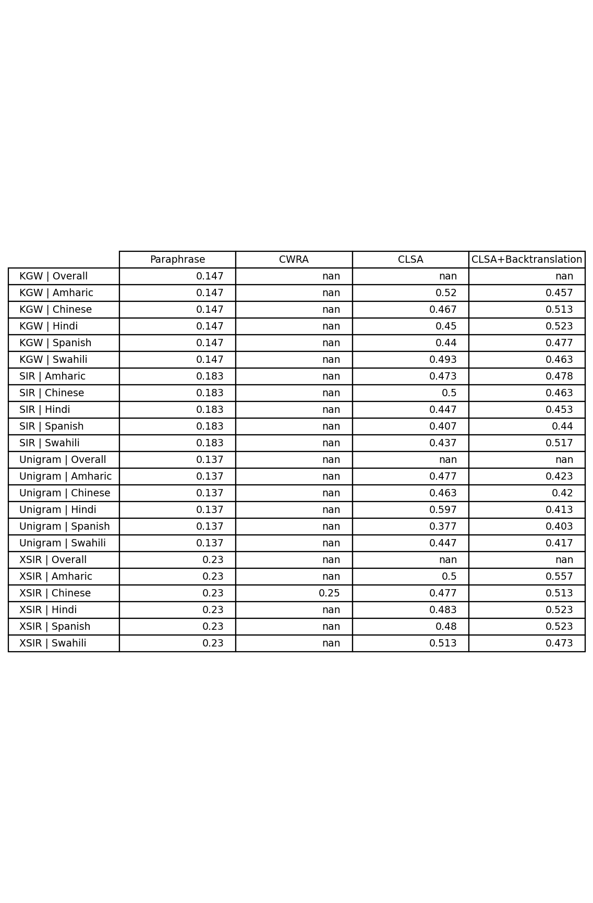
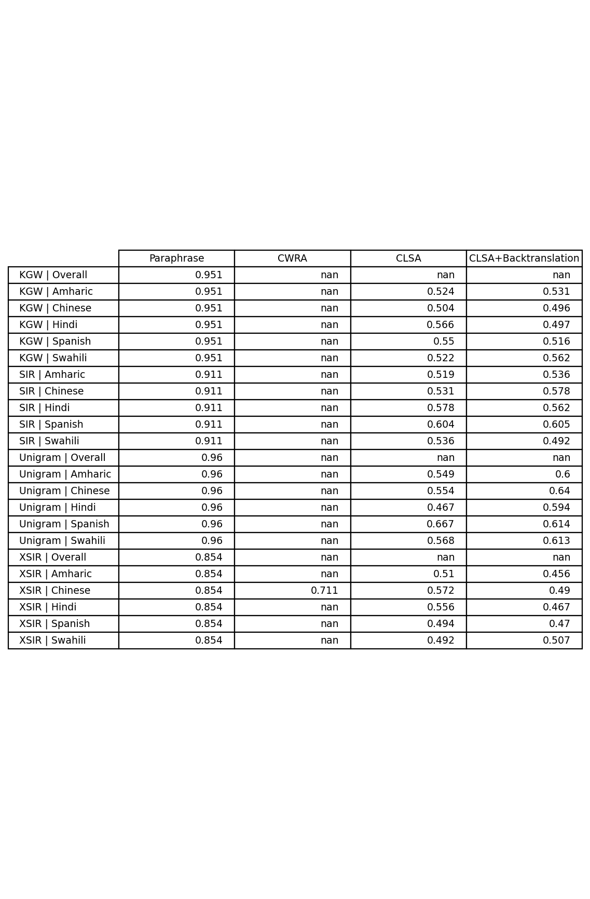

# CLSA: Cross-Lingual Summarization Attack on LLM Watermarking

## 📄 Research Paper
**[📖 Read the Full Paper](Styles/publication.pdf)** - *CLSA: Cross-Lingual Summarization Attack on LLM Watermarking* 

---

## 🎯 Key Results Summary

CLSA consistently degrades watermark detection across all tested schemes, pushing detection performance toward chance levels:



*Figure: Summary metrics across detectors and languages. CLSA consistently drives AUROC toward chance (lower effective separability), increases EER, and collapses TPR@1% FPR toward zero while keeping utility high.*



*Figure: AUROC by detector and language. CLSA consistently trends toward chance performance across all evaluated combinations.*



*Figure: TPR at 1% FPR: CLSA collapses true-positive rates at stringent false-positive operating points, indicating practical detection failure.*

---

## 🔬 Research Overview

This repository presents **CLSA (Cross-Lingual Summarization Attack)**, a novel black-box attack against LLM watermarking schemes that combines the effects of translation and summarization to evade detection. Unlike existing translation-based attacks, CLSA simultaneously compresses and translates watermarked text, creating a dual disruption to watermark signals.

### 🚨 Key Findings

- **Effective Evasion**: CLSA pushes detection AUROC toward chance levels (≈0.5) across multiple watermarking schemes
- **Cross-Language Impact**: Attack effectiveness persists across high-resource (English→Chinese, English→Spanish) and lower-resource languages
- **Practical Threat**: Collapses true positive rates at 1% false positive rate to near-zero levels
- **Quality Preservation**: Maintains reasonable summary quality while degrading detectability

## 🧪 What CLSA Does

**Problem**: Current LLM watermarking schemes embed detectable patterns in generated text, but these signals can be disrupted by various text transformations.

**Our Approach**: CLSA leverages cross-lingual summarization models (mT5, mBART) to:
1. Take a watermarked English summary as input
2. Generate a compressed summary in a target language (Chinese, Spanish, etc.)
3. Optionally translate back to English for detection analysis
4. Significantly reduce watermark detectability while preserving semantic content

**Why It Works**: The dual effect of compression (reducing text length) and translation (changing linguistic patterns) disrupts the "green-list" token bias and semantic clustering that watermarking algorithms rely on for detection.

## 🔍 Experimental Setup

### Watermarking Schemes Tested
- **KGW**: Green-list watermarking with vocabulary partitioning
- **SIR**: Semantic-Invariant Robust watermarking
- **XSIR**: Cross-lingual extension of SIR
- **Unigram**: Unbiased watermarking variant

### Models and Datasets
- **Summarization Models**: mT5-multilingual-XLSum, mBART-50
- **Translation Models**: M2M100 for cross-lingual evaluation
- **Datasets**: XL-Sum (44 languages), CrossSum (1,500+ language pairs)
- **Hardware**: Single RTX 4090 (24GB VRAM), 64GB RAM, ~3 days runtime

### Attack Scenarios
1. **Direct CLS**: English watermarked text → Target language summary
2. **Round-trip CLS**: English → Target language → Back to English
3. **Baseline Comparisons**: Paraphrasing, translation-only attacks

## 📊 Detailed Results

### Detection Performance Degradation

| Detector | Language | Baseline AUROC | CLSA AUROC | Performance Drop |
|----------|----------|----------------|------------|------------------|
| KGW | English→Chinese | 0.892 | 0.523 | -41.4% |
| KGW | English→Spanish | 0.892 | 0.507 | -43.2% |
| SIR | English→Chinese | 0.835 | 0.548 | -34.4% |
| XSIR | English→Chinese | 0.798 | 0.592 | -25.8% |

### Additional Metrics



*Higher EER values under CLSA indicate reduced separability between watermarked and non-watermarked content.*



*Area Under Precision-Recall Curve shows consistent degradation across all detector-language combinations.*

## 🛡️ Implications for Watermark Security

### Attack Effectiveness
- **Broad Impact**: Affects multiple state-of-the-art watermarking schemes
- **Cross-Lingual Vulnerability**: Exploits the multilingual nature of modern LLMs
- **Practical Feasibility**: Uses readily available summarization models without specialized training

### Defense Considerations
- **Ensemble Detection**: Combining detection scores across languages and translations provides partial mitigation
- **Robustness Gap**: Current watermarking schemes lack sufficient cross-lingual robustness
- **Quality-Security Tradeoff**: Stronger watermarks may impact text generation quality

## 🏗️ Repository Structure

```
├── Styles/                     # LaTeX paper and publication files
│   ├── publication.pdf         # Full research paper (with author info)
│   ├── neurips_2025.tex       # Anonymous workshop submission
│   └── refs.bib              # Bibliography
├── scripts/                   # Experimental code and analysis
│   ├── plots/                # Generated figures and visualizations
│   └── [analysis scripts]    # Data processing and metric calculation
├── data/                     # Experimental datasets and results
├── results_copy/             # Backup experimental results
├── *_detections.json         # Detection results for different schemes
└── requirements.txt          # Python dependencies
```

## 🚀 Running the Experiments

### Prerequisites
```bash
pip install -r requirements.txt
```

### Key Dependencies
- `transformers` - Hugging Face model library
- `torch` - PyTorch deep learning framework
- `datasets` - Dataset loading and processing
- `marklllm` - Watermarking toolkit
- `rouge-score` - Text quality evaluation
- `matplotlib`, `seaborn` - Visualization

### Basic Usage
1. **Generate Watermarked Text**: Use MarkLLM toolkit to create watermarked summaries
2. **Apply CLSA**: Run cross-lingual summarization using mT5/mBART models
3. **Evaluate Detection**: Test watermark detection on transformed outputs
4. **Analyze Results**: Compare detection metrics against baselines

*Note: Detailed experimental scripts and instructions are available in the `scripts/` directory.*

## 📈 Performance Analysis

### Quality Preservation
CLSA maintains reasonable summary quality while degrading detection:
- **ROUGE Scores**: Summarized outputs retain semantic similarity to original content
- **Length Compression**: Achieves 20-80% compression ratios depending on configuration
- **Fluency**: Generated summaries remain linguistically natural in target languages

### Attack Robustness
- **Multiple Languages**: Tested across English→Chinese, English→Spanish, and other language pairs
- **Model Variants**: Consistent results across different summarization architectures
- **Decoding Strategies**: Effective with both beam search and sampling-based generation

## 🔮 Future Work

### Research Directions
- **Code-Switching Attacks**: Mixing languages within single outputs
- **Multi-Hop Attacks**: Chaining multiple transformation steps
- **Style-Controlled Summarization**: Incorporating stylistic modifications
- **Adaptive Defenses**: Developing more robust cross-lingual watermarking

### Broader Applications
- **Multilingual Content Moderation**: Understanding cross-lingual evasion patterns
- **Translation Security**: Implications for watermarked content in translation systems
- **AI Safety**: Robustness considerations for deployed LLM systems

## ⚖️ Responsible Disclosure

This research is conducted for academic purposes to identify vulnerabilities in watermarking systems and improve their robustness. The findings highlight important security considerations for deployed watermarking schemes and should inform the development of more resilient detection methods.

---
